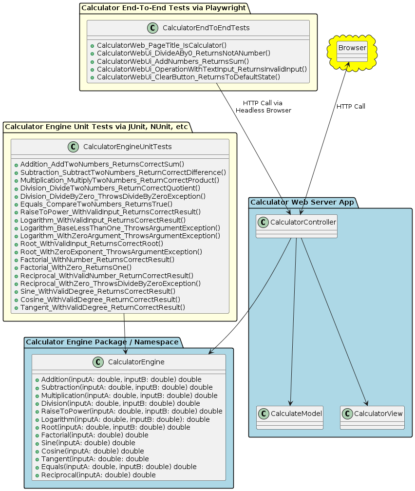
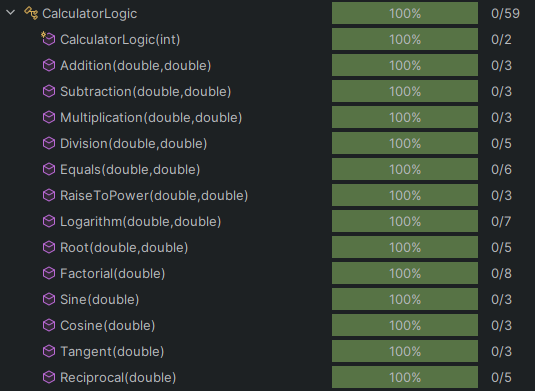

# KSU SWE 3643 Software Testing and Quality Assurance Semester Project: Web-Based Calculator

## Introduction

This repository contains the source code for a Blazer Web Application, alongside internal calculator logic, for primary functions. Additionally, there exist unit testing that covers 100% of the core calculator logic and End-to-End testing on the project. All testing is done with NUnit and playwright testing respectively.

## Table of Contents

- [Architecture](#architecture) 
- [Environment](#environment) 
- [Executing the Web Application](#executing-the-web-application) 
- [Executing Unit Tests](#executing-unit-tests) 
- [Reviewing Unit Test Coverage](#reviewing-unit-test-coverage) 
- [Executing End-to-End Tests](#executing-end-to-end-tests) 
- [Static Analysis Final Video Presentation](#static-analysis-final-video-presentation)


## Team Members

- Blake Youngs

## Architecture

The structure of the calculator is a solution with 4 projects: CalculatorEngine, CalculatorWebServerApp, CalculatorEngineUnitTests, and CalculatorEndToEndTests. By having a split up architecture into their responsibilities it results in a low coupling and high cohesion. The Web server is composed of the controller, model/data, and the view. Additionally, tests are utilized in to cover the Calculation logic and to tests components of the web application.



## Environment

This application should work across different platforms such as Windows, Mac OS, and Linux but has only been tested in Windows 11 environments.

Preparing the environment to execute the application:

1. Make sure that .NET SDK 8.0 on your system (https://dotnet.microsoft.com/en-us/download/dotnet/8.0)

2. Ensure the ASP.NET Core runtime is installed. 

Setting up the environment for NUnit testing:

- Install NUnit https://nunit.org/ or consider using a package manager like NuGet https://www.nuget.org/packages/NUnit

Setting up Playwright testing for End-to-End testing:

1. Make sure to install [PowerShell 7](https://learn.microsoft.com/en-us/powershell/scripting/install/installing-powershell-on-windows?view=powershell-7.4)
2. In the terminal execute the command `dotnet tool install --global Microsoft.Playwright.CLI`.
3. Using command `cd`, navigate to the **CalculatorEndToEndTests** folder, and execute the command `playwright install`.

## Executing the Web Application

Steps to executing the Web Application:

1. Open up the terminal and navigate to the solutions location using the `cd` command.

2. Now navigate the **CalculatorWebServerApp**

3. Use the command `dotnet run` to start executing the application

   ​     You have done it correctly if your screen looks like this

   

4. Copy the URL into your browser from the output to connect to the calculator. It should be `https://localhost:5167`.

## Executing Unit Tests

Steps to executing the Unit Tests for the Calculator Engine:

1. Open up the terminal and navigate to the solution's location using the cd command.

2. Now navigate the CalculatorEngineUnitTests

3. Use the command `dotnet test` to start executing the application

4. You have done it correctly if your screen looks like this:

   ```
   Starting test execution, please wait...
   A total of 1 test files matched the specified pattern.
   
   Passed!  - Failed:     0, Passed:    21, Skipped:     0, Total:    21, Duration: 15 ms - CalculatorEngineUnitTests.dll (net8.0).
   ```

   

## Reviewing Unit Test Coverage

With all of the unit tests executed it shows the 100% coverage of the CaluclatorEngine project.



## Executing End-to-End Tests

Steps to executing the End-to-End Tests:

1. Open up the terminal and make sure the web app is running before executing the tests.

2. In the terminal type `dotnet test "ProjectInstallPath\SWE-3643-Spring2024-Project\src\CalculatorEndToEndTests\bin\Debug\net8.0\CalculatorEndToEndTests.dll"`.

3. You have done it correctly if your screen looks like this:

   ```
   Starting test execution, please wait...
   A total of 1 test files matched the specified pattern.
   
   Passed!  - Failed:     0, Passed:     5, Skipped:     0, Total:     5, Duration: 2 s - CalculatorEndToEndTests.dll (net8.0)
   ```

   

## Final Video Presentation

[Video Presentation](https://youtu.be/NhOkguncR-I)
